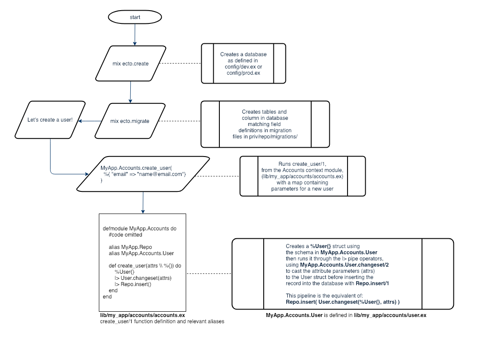

# Phoenix App Architecture Design: Contexts, Schemas, Changesets, and Migrations

#### Usage flowchart



Assume we have a Phoenix app with the name MyApp (my_app).

Let’s say our app needs a User data table in its database for user records, and logic in our Phoenix app to manipulate these records in the database.

Following Phoenix design conventions, we would need:

1. A User **Migration** that creates our User table in our connected database, defining its columns and indices.
2. A User **Schema** that maps the User data model and its relationships to an Elixir struct for use within our Elixir app functions, along with a related **Changeset** function.
3. A **Context** for User that contains the business logic for our User data, such as getting, setting, deleting, and updating User data in our database, typically with Repo commands, according to our User schema and changeset. In this case, let’s call the User’s context Accounts.

Contexts are also useful in that they are designed to contain all of the business logic for related schemas. One common pattern is to have a database with one table for Users and one table for Credentials (passwords, etc), a file for each User and Credential schema and changeset, and an Accounts context that contains database business logic for both Users and Credentials.

The directory structure for this context / schema, migration pattern in a standard Phoenix >= 1.3 project:

```
Directory Structure

~/                          # Project root
├── lib/                    # Project source
│   └── my_app/             # MyApp db & non-web facing code  
│       └── accounts/        
│           ├── accounts.ex          # Accounts Context module, contains business logic for data within the Accounts context
│           ├── credential.ex        # Credential module, contains credential schema, changeset, and related functions.
│           └── user.ex              # User module, contains user schema, changeset, and related functions.
└── priv/        
    └── repo/               # refers to Ecto.Repo
        └── migrations/              # Folder for migrations
            ├── 20181111042650_create_users.exs     # Migration that creates user table, columns, indices       
            └── 20181111042914_create_credentials   # Migration that creates credential table, columns, indices

```

#### ~/lib/my_app/accounts/accounts.ex
- Accounts Context, module name **MyApp.Accounts**
#### .../accounts/user.ex
-  User Schema and Changeset, module name **MyApp.Accounts.User**
#### .../accounts/credential.ex
- Credential Schema and Changeset, module name **MyApp.Accounts.Credential**

#### ~/priv/repo/migrations/2018111104234_create_users.exs
- Migration for creating user table in database, prefixed with a timestamp
#### .../migrations/2018111104234_create_credentials.exs
- Migration for creating credential table in database, prefixed with a timestamp. The timestamp prefix to migration names is put in the database migrations table to determine what migrations have been run.

**Note**

Migrations, Schemas, and Changesets in this case are Ecto modules:

Ecto.Schema - https://hexdocs.pm/ecto/Ecto.Schema.html
Ecto.Changeset - https://hexdocs.pm/ecto/Ecto.Changeset.html
Ecto.Migration - https://hexdocs.pm/ecto_sql/Ecto.Migration.html
